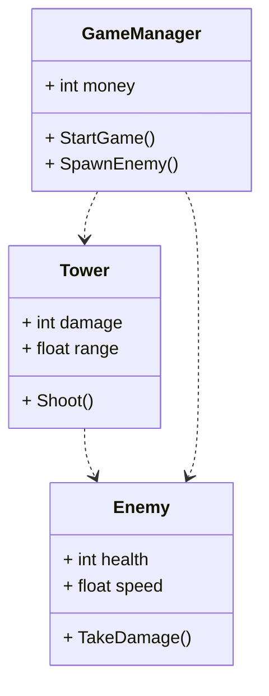

```mermaid
---
Title: Class Diagram Tower Defense
---
classDiagram

class Enemy {
    + int health
    + float speed
    + TakeDamage()
}

class Tower {
    + int damage
    + float range
    + Shoot()
}

class GameManager {
    + int money
    + StartGame()
    + SpawnEnemy()
}

Tower ..> Enemy
GameManager ..> Enemy
GameManager ..> Tower
```
